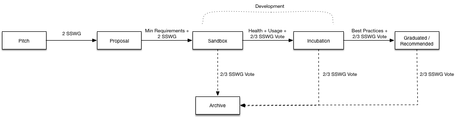

# Swift Server Work Group Incubation Process

version 1.0

## Overview

As described on https://swift.org/server/, the goal of the Swift Server Work Group (SSWG) is to create a robust, healthy ecosystem for server application development with Swift. One avenue to achieve this goal is to encourage the development of high quality, well maintained libraries and tools that the community can comfortably lean on.

The difference between the SSWG and the Swift Evolution process is that server-oriented libraries and tools that are produced as a result of work group efforts will exist outside of the Swift language project itself, and they will be distributed across different code bases.

The teams at Apple, IBM, and Vapor have engineers that will actively participate in the development of such libraries and tools and we would love to see the community joining in this effort. To that end, the work group defined and launches an incubation process where anyone can pitch, propose, develop, and contribute to such libraries and tools.

The incubation process is designed to help nurture and mature projects ensuring standardization, quality, and longevity. It also seeks to increase the visibility of ideas, experiments, or other early work that can add value to the SSWG mission. The following document details this incubation process.

## Process

Incubation is made of the following stages: **Pitch**, **Proposal**, **Development**, and **Recommendation**. The Development stage is where the majority of incubation take place. The SSWG will maintain a public "Swift Server Ecosystem" index page that will list all recommended tools and libraries as well as projects that are part of the incubation process and their respective incubation level.

### Pitch

Pitches are written proposals of new libraries or tools including ideas for new features in existing libraries or tools. They are used to collect feedback from the community and help define the exact scope of a project prior to writing code. Pitches are submitted by creating a new thread in the Swift Server forum area.

### Proposal

For a pitch to be moved into the Proposal stage, it must be endorsed by at least two members of the SSWG. The scope of the proposed code needs to closely align with the endorsed Pitch and it is subject to review based on the SSWG graduation criteria defined below. Proposal are submitted by creating a new thread in the Swift Server forum area with a link to the code repository in question.  Proposals submitted to the SSWG must provide the following information:
* Name (must be unique within SSWG)
* Description (what it does, why it is valuable, origin, and history)
* Statement on alignment with SSWG mission
* Preferred initial maturity level (see SSWG Graduation Criteria)
* Sponsor (where applicable)
* Initial committers (how long working on project)
* Link to source (GitHub by default)
* External dependencies (including licenses)
* Release methodology and mechanics
* License (Apache 2 by default)
* Issue tracker (GitHub by default)
* Communication channels (slack, irc, mailing lists)
* Website (optional)
* Social media accounts (optional)
* Community size and any existing sponsorship

The SSWG votes on pending proposals on a bi-weekly cadence, with the goal of voting on at least two proposals per month.

### Graduation Criteria

Every SSWG project has an associated maturity level: **Sandbox**, **Incubating**, or **Graduated**. Proposals should state their preferred initial maturity level and the SSWG will take a vote to decide on the actual level. 

A **supermajority** (two-thirds) is required for a project to be accepted as Incubating or Graduated. If there is not a supermajority of votes to enter at the Graduated level, then the votes toward Graduated are recounted as votes to enter at the Incubating level. If there is not a supermajority of votes to enter at the Incubating level, then all votes are recounted as **sponsorship** to enter at the Sandbox level. If there are not at least two sponsors, the Proposal is rejected.

#### Sandbox Level

To be accepted at the Sandbox level, a project must meet the [SSWG minimal requirements](#minimal-requirements) detailed below and be endorsed by at least two SSWG sponsors.

Early adopters should treat early stage projects with extra care. While Sandbox projects are safe to try out, it is expected that some projects may fail and never move to the next maturity level. There is no guarantee of production readiness, users, or professional level support. As such, users must exercise their own judgment.

#### Incubating Level

To be accepted at Incubating level, a project must meet the Sandbox level requirements plus:

* Document that it is being used successfully in production by at least three independent end users which, in the SSWG judgement, are of adequate quality and scope.
* Have a healthy number of committers.
* Demonstrate a substantial ongoing flow of commits and merged contributions.
* Receive a supermajority vote from the SSWG to move to Incubation stage.

#### Graduated Level

To be accepted at Graduated level, a project must meet the Incubating level criteria plus:

* Adopt all [SSWG best practices](#best-practices), as detailed below.
* Have committers from at least two organizations.
* Receive a supermajority vote from the SSWG to move to Graduation stage.

### Ecosystem Index

All projects and their respective levels will be listsed on the Swift Server Ecosystem index page. In cases where more than one project solves a particular problem (e.g., two similar database drivers), they will be ordered by popularity. The SSWG reserves the right to define a singular solution for critical building blocks, such as Logging or Metrics APIs, where consistency across the ecosystem is of a critical nature.

The SSWG will meet every 6 month to review all projects, and it reserves the right to demote, archive, or remove projects that no longer fulfill minimal requirements. For example, a Graduated project that no longer receives regular updates or fails to address security concerns in timely fashion. Similarly, the SSWG reserves the right to remove or archive Pitches and Proposals that no longer receive updates.

Changes to the Swift Server Ecosystem index page will be announced by the SSWG using the Swift Server forums.

## Minimal Requirements

* General
  * Publicly accessible source managed by an SCM such as github.com or similar
  * Adopt the [Swift Code of Conduct](https://swift.org/community/#code-of-conduct)
  * [Developer Certificate of Origin](https://developercertificate.org) or a [Contributor License Agreement](https://en.wikipedia.org/wiki/Contributor_License_Agreement)
* Ecosystem
  * Uses SwiftPM
  * Integrated with critical SSWG ecosystem building blocks, e.g., Logging and Metrics APIs, SwiftNIO for IO
* Concurrency / IO
  * Packages should be non-blocking (w/ async API) unless not possible (blocking C libs, etc)
  * There should be as little (preferably no) wrapping of NIO as possible. Exposing NIO types directly will go a long way for making packages compatible.
  * Blocking code should be wrapped in NonBlockingIOPool (like Vapor's SQLite package)
* Testing, CI and Release
  * Have unit tests for Linux
  * CI setup, including testing PRs and the master branch
  * Follow semantic versioning
* Conventions and Style
  * Error handling
  * C wrapping vs native swift
  * Code style guidelines
  * Uses force unwraps and force tries only as preconditions, ie. conditions that the programmer regards as impossible or programmer error. All force tries/unwraps should come with a comment stating the reasons.
* Longevity
  * Must be a team of 2+ developers
  * Must be from a team that has more than one public repository (or similar indication of experience)
  * SSWG should have access / authorization to graduated repos in case of emergency
* Licensing
  * Apache 2

## Best Practices

* CI setup across all supported Swift and Linux versions
* Unit tests for both macOS and Linux
* Use official docker (when appropriate)
* Documented release methodology
* All packages should always work with at least the latest released version of Swift
* Explicitly define a project governance and committer process, ideally laid out in a GOVERNANCE.md file and OWNERS.md files respectively
* Include list of adopters for at least the primary repo ideally laid out in an ADOPTERS.md files or logos on the project website

## Process Diagram

## Change Management

Changes to the incubation process must be documented and published publicly, and they are subject to semantic versioning schema:

* Major: Represents a deeper change in approach or workflow
* Minor: Small change in concepts or nomenclature.

Updates resulting in a version bump require a supermajority vote from the SSWG. Trivial changes, such as fixing typos or formatting, do not require a version bump. 

## Resources and References

* https://github.com/apple/swift-evolution
* https://github.com/cncf/toc/tree/master/process
* https://incubator.apache.org
